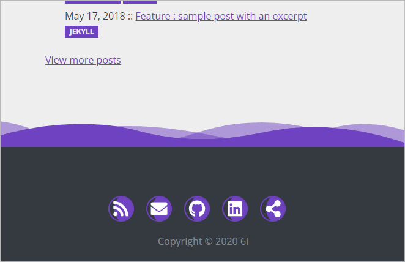

6i-Jekyll
=========

## Configure "*Follow me*" & "*Social share*" buttons in footer

Open `_config.yml` and find social section.

- to enable a "Social share" button, fill it with `true`. And keep empty for disable it.
- to enable the RSS button in footer, do the same as "Social share" button.
- to enable contact by email in footer, fill `email_address` with yours.
- to enable a "Follow me" button, fill it with your username account. And keep empty for disable it.

### Example

```yml
social:
  # Enable social share button
  share_buttons:
    twitter: true
    linkedin: true
    facebook: 
    email: true

  # Enable icons in footer : RSS, email and follow buttons
  rss: true
  email_address: vb20100bv@gmail.com
  github: "v20100v"
  twitter:
  facebook: 
  linkedin: "v20100v"
```

The result in footer page is :




## How to add a new prodider for "follow me" and "social share" ?

1. Make a pull request (🙏 thx ^^.).
2. Find the right icon in [https://fontawesome.com/](https://fontawesome.com/).   
3. Edit `footer/followMe.html` in order to add a new "*Follow me button*".
4. Edit `footer/socialShare.html` in order to add a new "*Share button*".
5. Edit `_config.yaml` and add a new variable into social section.
6. Don't forget to restart the server (`yarn dev`) for changes of configuration file to take effect. 


### Example with "follow me on Github" button

To enable it, set `social.github: v20100v` in config.yml. Fill it with your username. Below the Liquid code.

```html

<li class="list-inline-item">
    <a href="https://github.com/{{ site.social.github }}"
       title="Follow me on GitHub">
                            <span class="fa-stack fa-lg">
                                <i class="fa fa-circle fa-stack-2x"></i>
                                <i class="fab fa-github fa-stack-1x fa-inverse"></i>
                            </span>
    </a>
</li>

```

### Example with "social share content in facebook" button

To enable it, set `social.share_buttons.facebook: true` in config.yml. Below the Liquid code.

```html

<a href="https://www.facebook.com/sharer/sharer.php?u={{ page.url | absolute_url | url_encode }}"
   target="_blank"
   title="Share on Facebook">
    <i class="fab fa-facebook" aria-hidden="true"></i>
</a>

```

<br>

Back to [README](../README.md).