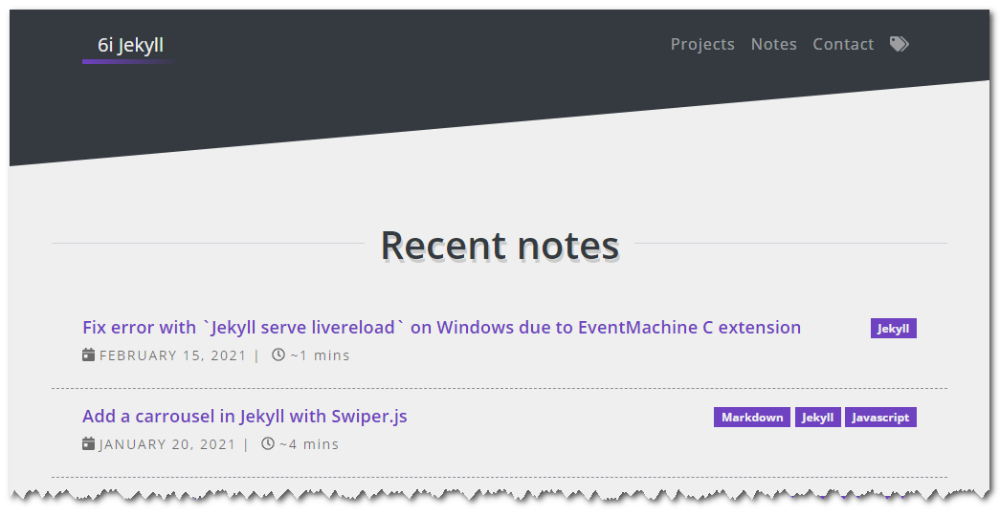

6i-Jekyll-theme
===============

## Feature : Calculation reading time of a post

Provide a simple feature to estimated reading time of a post. To enable this feature, just set to true `calc_reading_time.enable` in `_config.yml`. 

In the configuration of this feature, it is possible to define the number of words read on average per minute, and a TL;DR (too long, don't read) message.

```
// _config.yaml

# -----------------------------
#  Calculation of reading time
# -----------------------------
calc_reading_time:
  enable: true            # Enable/ disable it
  words_by_minutes: 180   # Set the number of words read per minute on average
  tldr:
    enable: true          # If max_time is exceeded, add a TL;DR message
    max_time: 360         # To be set in minutes (360 min = 6h)
    message: 'TL;DR'      # To customize the TL;DR message
```

## Showcase




## Take a look under the hood

All in one liquid file 

```html
// ./_includes/functions/calcReadingTime.html





&nbsp;|&nbsp;
<span class="reading-time" title="Estimated read time">
  <i class="far fa-clock"></i>&nbsp;
  
    ~1 min
  
    {{ site.calc_reading_time.tldr.message }}
  
    
    

    
      ~{{ hours }}h:{{ minutes }}mins
    
      ~{{ readingTime}} mins
    
  
</span>

```

To use this liquid element, just add it into a layout or a page with `include` directive. 

```html
// ./_layout/home.html

(...)

<li class="note-stub d-flex flex-column flex-lg-row flex-xl-row justify-content-between">
    <a href="{{ post.url | relative_url }}" title="Go to post detail" class="flex-grow-1">
        <h4 class="note-title">{{ post.title }}</h4>
        <div class="note-metadata">
            <span class="note-date">
                <i class="fas fa-calendar-day"></i>&nbsp; 
            </span>
            
        </div>
    </a>

    <span class="note-tags ml-4 text-lg-end text-xl-end text-xxl-end">
        <span class='badge bg-primary badge-tag'>{{ post.tags | join: "</span> <span class='badge bg-primary badge-tag'>"}}</span>
    </span>
</li>
```