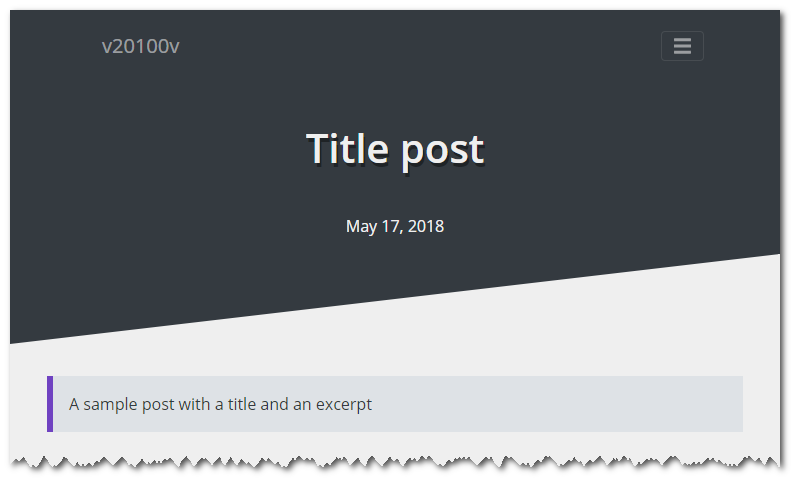
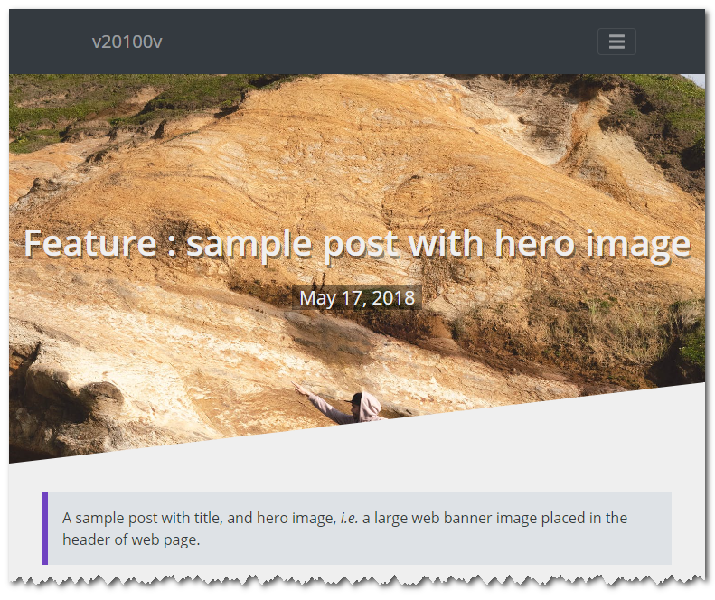

6i-Jekyll
=========

## Feature : Add hero image on a page

### What is hero image ?

A page can have an hero image, *i.e.* a large web banner image placed in the header of web page.

A post without hero image :



A post with an hero image :




### How to add an hero image into a post, or a page ?

Just fill `image` in the YAML front matter of your post or page with a relative path of an image. 

```
image: "assets/images/hero/open.jpg"
```

Or you can also pass an object with a 
- path variable, 
- and optionally thumbnail and credits variable.

```
image:
    path: "assets/images/hero/open.jpg"
    thumbnail: "assets/images/hero/open.jpg"
    credits: "Photo from AdobeStock id 349298204"
```

<br>

Back to [README](../README.md).